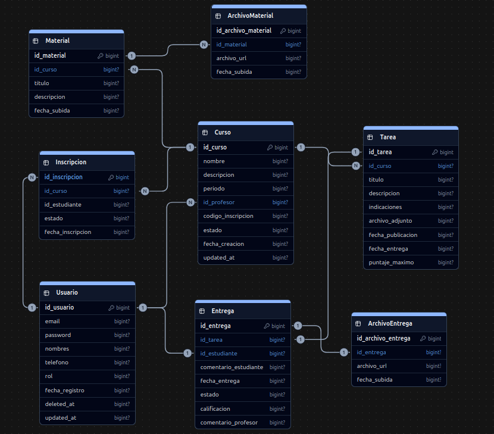

<h1 align="center">Classly · API</h1>
<p align="center">API REST de aulas virtuales — clases, materiales, tareas y calificaciones</p>

<p align="center">
  
  
  
  
  
  
</p>

<p align="center">
  <a href="https://classly-react.vercel.app"></a>
  <a href="https://github.com/leandro291/classly-react"></a>
</p>

<p align="center">
  
</p>

## Características

- Autenticación con JWT (access token de 1 hora y refresh token de 30 días).
- Roles de usuario: `teacher` y `student`, con permisos diferenciados por rol y por objeto.
- Cursos con código de inscripción autogenerado y soft-delete: al eliminarlos solo cambian a `status = inactive`, sin borrado físico.
- Inscripción con validación de código y control de estados (`active` / `deactivated`).
- Materiales y tareas con archivos subidos a Cloudinary mediante `multipart/form-data`.
- Entrega única por tarea garantizada a nivel de base de datos y devolviendo un error controlado (400) ante intentos duplicados.
- Calificación de entregas por parte del profesor (puntaje 0-20 y comentario).
- Documentación de la API generada automáticamente con drf-spectacular (Swagger UI y Redoc).
- Panel de administración con django-jazzmin.

## Stack tecnológico

| Tecnología | Versión |
| --- | --- |
| Python | 3.14 |
| Django | 6.1 |
| Django REST Framework | 3.18 |
| djangorestframework-simplejwt | 5.5 |
| drf-spectacular | 0.30 |
| PostgreSQL | — |
| Cloudinary | 1.45 |
| django-jazzmin | 3.0 |
| gunicorn / whitenoise | — |
| python-dotenv | — |

## Requisitos previos

- Python 3.14
- PostgreSQL (o un servicio administrado compatible)
- Una cuenta de Cloudinary con `cloud_name`, `api_key` y `api_secret`

## Instalación y configuración

1. Clonar el repositorio y crear el entorno virtual:

   ```bash
   git clone <url-del-repositorio>
   cd classly
   python3.14 -m venv .venv
   source .venv/bin/activate
   ```

2. Instalar las dependencias:

   ```bash
   pip install -r requirements.txt
   ```

3. Crear el archivo `.env` en la raíz del proyecto con las siguientes variables:

   | Variable | Descripción |
   | --- | --- |
   | `SECRET_KEY` | Clave secreta de Django. |
   | `DEBUG` | `True` en desarrollo, `False` en producción. |
   | `DB_NAME` | Nombre de la base de datos. |
   | `DB_USER` | Usuario de la base de datos. |
   | `DB_PASSWORD` | Contraseña de la base de datos. |
   | `DB_HOST` | Host de la base de datos. |
   | `DB_PORT` | Puerto de la base de datos. |
   | `CLOUDINARY_CLOUD_NAME` | Nombre del cloud de Cloudinary. |
   | `CLOUDINARY_API_KEY` | API key de Cloudinary. |
   | `CLOUDINARY_API_SECRET` | API secret de Cloudinary. |

4. Aplicar las migraciones y levantar el servidor:

   ```bash
   python manage.py migrate
   python manage.py runserver
   ```

El proyecto quedará disponible en `http://localhost:8000`.

## Estructura del proyecto

```
classly/
├── classly/              # Configuración del proyecto (settings, urls, wsgi)
├── users/                # Modelo de usuario, registro, login y refresh JWT
│   └── api/
├── cursos/               # Cursos e inscripciones
│   └── api/
├── contenidos/           # Materiales y archivos de material
│   └── api/
├── tareas/               # Tareas, entregas y archivos de entrega
│   └── api/
├── .env                  # Variables de entorno (no versionar)
├── build.sh              # Script de despliegue
├── manage.py
└── requirements.txt
```

Cada aplicación expone su API en la carpeta `api/` organizada en `serializers.py`, `views.py`, `urls.py` y `permissions.py`.

## Modelos y relaciones

El diagrama de la base de datos está disponible en [`ModeladoDB.png`](ModeladoDB.png).

| Modelo | Campos principales | Relaciones |
| --- | --- | --- |
| `User` | `email` (login), `username`, `first_name`, `last_name`, `telephone`, `rol` (`teacher`/`student`) | — |
| `Curso` | `name`, `description`, `period`, `registration_code` (único, autogenerado), `status` (`active`/`inactive`) | `teacher` → `User`; `inscripciones` → `Inscripcion` |
| `Inscripcion` | `status` (`active`/`deactivated`) | `course` → `Curso`; `student` → `User` |
| `Material` | `title`, `description`, `created_at` | `course` → `Curso`; `archivo_materials` → `ArchivoMaterial` |
| `ArchivoMaterial` | `file` (Cloudinary) | `material` → `Material` |
| `Tarea` | `title`, `description`, `file` (Cloudinary, opcional), `max_score` (0-20), `due_date` | `course` → `Curso`; `entregas` → `Entrega` |
| `Entrega` | `student_comment`, `teacher_comment`, `status` (`a_tiempo`/`tardia`), `score` (0-20, opcional) | `assignment` → `Tarea`; `student` → `User`; `archivos` → `ArchivoEntrega` |
| `ArchivoEntrega` | `file` (Cloudinary) | `submission` → `Entrega` |

Restricciones de integridad:
- El código de registro de un curso es único.
- Un estudiante no puede estar inscrito dos veces en el mismo curso (`UniqueConstraint` sobre `course` y `student`).
- Un estudiante no puede entregar dos veces la misma tarea (`UniqueConstraint` sobre `assignment` y `student`).

## Autenticación

El flujo de autenticación es el siguiente:

1. **Registro**: `POST /api/auth/register/` con `username`, `email`, `first_name`, `last_name`, `telephone`, `rol` y `password`.
2. **Login**: `POST /api/auth/login/` con `email` y `password` → devuelve `access` y `refresh`.
3. **Renovación**: `POST /api/auth/refresh/` con el `refresh` → devuelve un nuevo `access`.

Los endpoints protegidos se autentican con el header:

```
Authorization: Bearer <access_token>
```

El access token tiene una duración de 1 hora y el refresh de 30 días. El token incluye los claims `username`, `email` y `rol`.

## Endpoints de la API

### Auth

| Método | Ruta | Permisos | Descripción |
| --- | --- | --- | --- |
| `POST` | `/api/auth/register/` | Público | Registra un nuevo usuario. |
| `POST` | `/api/auth/login/` | Público | Inicia sesión y devuelve los tokens. |
| `POST` | `/api/auth/refresh/` | Público | Renueva el access token. |

### Cursos

| Método | Ruta | Permisos | Descripción |
| --- | --- | --- | --- |
| `GET` | `/api/course/` | Autenticado | Lista los cursos: `teacher` ve los suyos, `student` los que tiene inscritos. |
| `POST` | `/api/course/` | `teacher` | Crea un curso. |
| `POST` | `/api/course/join/` | `student` | Se inscribe en un curso mediante el código de registro. |
| `GET` | `/api/course/<pk>/` | Miembro del curso | Obtiene el detalle de un curso. |
| `PUT`/`PATCH` | `/api/course/<pk>/` | Profesor propietario | Actualiza un curso. |
| `DELETE` | `/api/course/<pk>/` | Profesor propietario | Marca el curso como `inactive` (soft-delete). |

### Materiales

| Método | Ruta | Permisos | Descripción |
| --- | --- | --- | --- |
| `GET` | `/api/course/<course_pk>/material/` | Miembro del curso | Lista los materiales del curso. |
| `POST` | `/api/course/<course_pk>/material/` | Profesor propietario | Crea un material con sus archivos (multipart). |
| `GET` | `/api/material/<pk>/` | Miembro del curso | Obtiene el detalle de un material. |
| `PUT`/`PATCH` | `/api/material/<pk>/` | Profesor propietario | Actualiza un material y sus archivos (multipart). |
| `DELETE` | `/api/material/<pk>/` | Profesor propietario | Elimina un material. |

### Tareas

| Método | Ruta | Permisos | Descripción |
| --- | --- | --- | --- |
| `GET` | `/api/course/<course_pk>/tarea/` | Miembro del curso | Lista las tareas del curso. |
| `POST` | `/api/course/<course_pk>/tarea/` | Profesor propietario | Crea una tarea con su archivo (multipart). |
| `GET` | `/api/tarea/<pk>/` | Miembro del curso | Obtiene el detalle de una tarea. |
| `PUT`/`PATCH` | `/api/tarea/<pk>/` | Profesor propietario | Actualiza una tarea y su archivo (multipart). |
| `DELETE` | `/api/tarea/<pk>/` | Profesor propietario | Elimina una tarea. |

### Entregas

| Método | Ruta | Permisos | Descripción |
| --- | --- | --- | --- |
| `GET` | `/api/tarea/<workhome_pk>/entrega/` | Miembro del curso | Lista las entregas: `teacher` todas, `student` solo las suyas. |
| `POST` | `/api/tarea/<workhome_pk>/entrega/` | `student` inscrito | Envía una entrega (comentario y archivos multipart). Máximo una por tarea. |
| `GET` | `/api/entrega/<pk>/` | Propietario o profesor del curso | Obtiene el detalle de una entrega. |
| `PUT`/`PATCH` | `/api/entrega/<pk>/` | Profesor: califica (`score` y `teacher_comment`); estudiante dueño: edita comentario y archivos | Actualiza una entrega. |
| `DELETE` | `/api/entrega/<pk>/` | Propietario o profesor del curso | Elimina una entrega. |

## Roles y permisos

- **teacher**: crea y administra cursos, publica materiales y tareas, y califica las entregas de sus cursos (puntaje 0-20 y comentario). Ve todas las entregas de sus cursos.
- **student**: se inscribe a cursos mediante código, consulta materiales y tareas de los cursos con inscripción activa, y envía o edita sus propias entregas. Solo puede entregar una vez por tarea.

Los permisos se aplican tanto a nivel de rol (`IsTeacher`, `IsStudent`) como a nivel de objeto (`IsCourseTeacher`, `IsMaterialTeacher`, `IsTareaTeacher`, `IsSubmitOwner`). Las operaciones de escritura quedan restringidas al profesor propietario del curso o al dueño de la entrega; las lecturas se permiten a los miembros del curso con inscripción activa.

## Manejo de archivos

Los archivos se suben como `multipart/form-data` y se almacenan en Cloudinary:

- **Materiales**: campo `archivos` (lista de archivos).
- **Tareas**: campo `file_upload` (archivo único).
- **Entregas**: campo `file_upload` (lista de archivos).

## Documentación de la API

Con el servidor en ejecución:

- **Swagger UI**: `http://localhost:8000/api/schema/swagger/`
- **Redoc**: `http://localhost:8000/api/schema/redoc/`
- **Schema JSON**: `http://localhost:8000/api/schema/`

## Panel de administración

El panel de administración con django-jazzmin está disponible en `http://localhost:8000/admin/` para usuarios con `is_staff`.

## Despliegue

El script [`build.sh`](build.sh) prepara la aplicación para producción:

```bash
pip install -r requirements.txt
python manage.py collectstatic --no-input
python manage.py makemigrations
python manage.py migrate
```

El proyecto incluye `gunicorn` como servidor WSGI y `whitenoise` para el servicio de estáticos.
